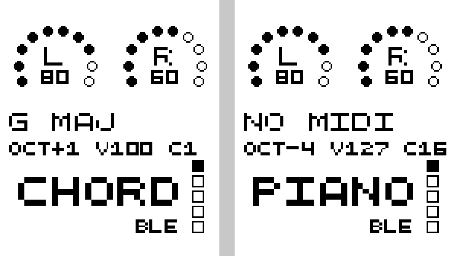

# Toucan2 as a Bluetooth MIDI controller (iPad)

The Toucan2 firmware has six **MIDI modes**: Piano, Grid, Drums, Chord,
Control and DJ. In them the keys send MIDI over Bluetooth instead of keystrokes, and
the trackpad works as an XY pad and velocity slider. The keyboard connects to the iPad over the
same Bluetooth link it already uses for typing. You don't need a cable, a
dongle, or a second pairing.

The firmware side is `modules/zmk-ble-midi`, a small ZMK module added for this
build. ZMK has no MIDI support of its own. The module adds the standard
Bluetooth LE MIDI service next to the keyboard service. iPadOS treats that as
a class-compliant Bluetooth MIDI device, so any MIDI app can use it:
GarageBand, Logic Pro, AUM, Loopy Pro, Drambo, Melodics, and others.

Only the Toucan2 has this. The Corne and Corne-ish Zen builds are unchanged.

## At a glance

| To... | Do this |
|---|---|
| Turn MIDI on / off | Press **both bottom outer pinky keys together**. MIDI always starts in Piano. |
| Switch mode | Hold the **right outer thumb** (MODE) and tap **Q** Piano, **W** Grid, **E** Drums, **R** Chord, **T** Control or **Y** DJ |
| Make the iPad find it | Hold MODE and tap **Pair** (bottom-right outer key) |
| Silence stuck notes | Hold MODE and tap **Panic** (bottom-left outer key) |
| Leave MIDI | The pinky combo again, or hold MODE and tap the left outer thumb |

**About the on/off combo:**
- It's ignored for 150 ms after any other keypress. Fast playing or typing
  can't trigger it by accident, and the two keys under it never wait on it
  mid-phrase.
- After a pause, those two keys can take up to 50 ms to sound, while the
  keyboard waits to see if the other one follows. In Piano that's B2 and F4
  (F4 is also on the home row), in Grid C3 and B3.

## One-time setup

1. **Flash both halves** with the new `toucan_left.uf2` / `toucan_right.uf2`.
   The MIDI service runs on the left (central) half.
2. **Let the iPad see the new service.** The iPad caches the list of services
   from when you paired the keyboard. The firmware tells it the list changed,
   but if the MIDI device never appears in the steps below, re-pair from
   scratch:
   - iPad: Settings → Bluetooth → Toucan ⓘ → *Forget This Device*.
   - Keyboard: on the **FUN** layer, press the iPad's profile key (the
     `BT 0–3` keys on the bottom-right row) *shifted*. That clears the profile.
   - Pair again from Settings → Bluetooth.

## Connecting a MIDI app (each session)

iPadOS apps connect to Bluetooth MIDI devices themselves, from their own
"Bluetooth MIDI Devices" panel. The panel only lists devices that are
advertising MIDI. A keyboard that is already connected for typing isn't
advertising, so **Pair** makes it advertise for 60 seconds:

1. Turn MIDI on (the pinky combo).
2. Open the app's Bluetooth MIDI panel:
   - **GarageBand:** open a song → Settings (gear) → Advanced →
     *Bluetooth MIDI Devices*.
   - **Other apps** (AUM, Loopy Pro, Melodics...): look for *Bluetooth
     MIDI* in the app's settings or MIDI setup. If an app has no such panel,
     connect once from GarageBand's panel and then switch apps. The
     connection is shared by every app.
3. Hold MODE and tap **Pair**. The keyboard shows up under its Bluetooth
   name. Tap it to connect. Advertising stops by itself once the app
   connects.

The connection lasts until the keyboard disconnects: sleep, walking away, or
a Bluetooth profile switch. After that, pair again. Turning MIDI off doesn't
disconnect it, so you can flip between typing and playing freely.

## The status screen

While a MIDI mode is on, the left half's screen replaces the typing-speed
graph with the MIDI state. The big text at the bottom is the mode.



*Approximate preview, rendered from the screen's real font and coordinates.*

- **Line 1** is the key and scale, e.g. `G MAJ`. It reads **`NO MIDI`**
  until an app is connected, which makes it a quick connection check.
- **Line 2** is octave, velocity and MIDI channel: `OCT+1 V100 C1`.

## Shared thumbs

In Piano, Grid and Chord, the thumbs are:

```
left:  Oct−   Sustain   Oct+        right:  Mod   Hold   MODE
```

- **Sustain** (Space position): sustain pedal, CC 64, while held.
- **Mod**: mod wheel at full (CC 1) while held.
- **Hold**: CC 85 at 127 while held, for MIDI Learn.
- Drums and Control use their own thumbs (see below). **MODE** is always the
  right outer thumb.

## The trackpad

On every MIDI layer the trackpad is a MIDI controller instead of a mouse. It
does three different jobs depending on how many fingers you use:

| Gesture | Does |
|---|---|
| **One finger** | **XY pad for effects.** Left/right sends **CC 16**, up/down sends **CC 17**, each 0–127. Map them with MIDI Learn to two "knobs", e.g. filter cutoff and resonance. |
| **Two fingers up / down** | **Velocity slider.** Sets how loud every note key plays, from 1 to 127. Up is louder. The screen's `V` value updates as you slide. |
| **Pinch** | **A third knob, CC 18.** Spread your fingers to raise it, pinch to lower it. |

- **The gestures can't interfere.** The trackpad itself tells one finger,
  two fingers and a pinch apart, so sliding velocity never moves the effect
  knobs and vice versa.
- **Starting values:** the three knobs start at 64. Velocity keeps whatever
  it was, and MODE + A/S still adjust it in steps of 16.
- **The mouse is off.** Clicks, scrolling and zoom do nothing on the MIDI
  layers; they come back when you turn MIDI off.

**Tuning:** the settings live on `&midi_xy` in `config/toucan.keymap` (add a
`&midi_xy { ... };` block).

| Setting | Default | Controls |
|---|---|---|
| `divisor` | 4 | How far one finger travels for the full 0–127. Higher gives finer control and needs more travel. |
| `velocity-divisor` | 2 | The same for the velocity slider |
| `velocity-invert` | off | Set this if moving your fingers up makes notes quieter |
| `pinch-cc` | 18 | Which CC pinch sends; `-1` turns pinch off |
| `pinch-divisor` | 2 | How much pinching covers the full range |

## Piano: 32 keys, laid out like a piano

GarageBand's *Musical Typing*, plus an octave of white keys below it.

- The **home row is the white keys**, starting with **middle C on the A key**.
- Each **sharp sits directly above** its natural, so the key above is one
  semitone higher. The keys above E and B are empty, as on a piano.
- The **bottom row repeats the home row an octave lower**, so the key below is
  one octave down. It's mostly for left-hand bass.

```
         outer  Q/A   W/S   E/D   R/F   T/G  │  Y/H   U/J   I/K   O/L   P/'  outer
top       --    C#4   D#4   --    F#4   G#4  │  A#4   --    C#5   D#5   --    F#5
home      B3    C4    D4    E4    F4    G4   │  A4    B4    C5    D5    E5    F5
bottom    B2    C3    D3    E3    F3    G3   │  A3    B3    C4    D4    E4    F4
```

C4 is middle C, MIDI note 60. GarageBand labels it **C3**. This is the mode
to use for Melodics piano lessons, because it matches the piano Melodics
shows on screen.

## Grid: 36 notes, one octave per row

Every semitone from C3 to B5 appears exactly once. Each row runs chromatically
from left to right, and the key above is an octave higher. It covers more
range than Piano, but it doesn't look like a piano.

```
         col:  1     2     3     4     5     6   │  7     8     9     10    11    12
top            C5    C#5   D5    D#5   E5    F5  │  F#5   G5    G#5   A5    A#5   B5
home           C4    C#4   D4    D#4   E4    F4  │  F#4   G4    G#4   A4    A#4   B4
bottom         C3    C#3   D3    D#3   E3    F3  │  F#3   G3    G#3   A3    A#3   B3
```

## Drums: a General MIDI kit

Each key plays a fixed drum sound; octave and key shifts don't affect it. It
uses the standard General MIDI drum notes, which GarageBand drum kits,
Melodics pad lessons and most drum apps understand. Kick and snare are under
your index fingers **and** on the thumbs, like pedals.

```
         outer   Q/A    W/S    E/D    R/F    T/G   │  Y/H    U/J    I/K    O/L    P/'    outer
top      Crash2 Splash OpenHH Crash  HiTom  HMTom  │  LMTom  LoTom  Ride   Bell   China  Ride2
home     Tamb   Stick  HiHat  Snare  Kick   Clap   │  Kick   Snare  FlrHi  FlrLo  Cowbl  Maraca
bottom   Claves PedHH  Snare2 BongoH BongoL CongaO │  CongaM CongaL TimbH  TimbL  Tri    Cabasa
thumbs                 HiHat  Kick   PedHH         │  Snare  Clap   MODE
```

## Chord: one key, one chord, in any key

The chord keys play the chords that belong to the current key, not fixed
chords. Change the key and every chord follows, so the same hand shapes work
in any key.

The columns are scale degrees I–VII, then I–III an octave up. Each row plays
them differently:

- **Top row:** seventh chords (four notes)
- **Home row:** triads (three notes)
- **Bottom row:** just the root, an octave lower, as a bass note for your
  left hand

```
         outer  Q/A   W/S   E/D   R/F   T/G  │  Y/H   U/J   I/K   O/L   P/'   outer
top       Key−  I7    ii7   iii7  IV7   V7   │  vi7   vii7  I7'   ii7'  iii7'  Key+
home      Maj/m I     ii    iii   IV    V    │  vi    vii   I'    ii'   iii'   Inv
bottom    Panic I     ii    iii   IV    V    │  vi    vii   I'    ii'   iii'   Reset
```

In C major the home row plays C Dm Em F G Am Bdim C Dm Em. Switch to G major
and the same keys play G Am Bm C D Em F#dim G Am Bm.

| Key | Does |
|---|---|
| Key− / Key+ | Move the key a semitone. The screen shows it, e.g. `G MAJ`. Key shifts Piano and Grid too, so they transpose along with it. |
| Maj/m | Switch between major and (natural) minor |
| Inv | Cycle root position → 1st → 2nd inversion. Inversions keep chord changes closer together, so they sound smoother. |
| Reset | Back to C major, root position, octave 0 |

## Control: a MIDI Learn control surface

Keys for AUM, Loopy Pro, Logic and other apps that let you map controls with
MIDI Learn.

```
         outer  Q/A   W/S   E/D   R/F   T/G  │  Y/H   U/J   I/K   O/L   P/'  outer
top       PC−   T20   T21   T22   T23   T24  │  T25   T26   T27   T28   T29   PC+
home      Ch−   M102  M103  M104  M105  M106 │  M107  M108  M109  M110  M111  Ch+
bottom    Panic Rec   Play  Stop  Cont  Vel− │  Vel+  Oct−  Oct+  Key−  Key+  Pair
thumbs                Rec   Play  Stop       │  --    --    MODE
```

- **T20–T29** are CC toggles: each press alternates 127 / 0. Use them for
  mutes, effects on/off, or loop tracks.
- **M102–M111** send CC 127 while held. Use them for clip or scene launch and
  other momentary actions.
- **PC−/+** send the previous or next program change, which switches patches
  in apps that support it. **Ch−/+** change the MIDI channel.
- **Rec / Play / Stop** send MIDI Machine Control (MMC). Play and Stop also
  send MIDI Start / Stop. Whether they work depends on the app; if one
  ignores them, map a toggle key with MIDI Learn instead.

## DJ: two decks for djay

For Algoriddim **djay** on iPad, or any DJ app with MIDI Learn. Your left
hand is deck 1 and your right hand is deck 2.

```
per hand, pinky → index (the right hand is the mirror image)
top      Load   HC1     HC2     HC3     HC4     FX1
home     PFL    Loop÷2  Loop×2  Loop    Play    Cue
bottom   Sync   LoopIn  LoopOut Nudge−  Nudge+  FX2
thumbs   Browse↑  Browse↓  Spare1  │  Spare2  Spare3  MODE
```

- **The decks are mirror images.** Each function is under the same finger on
  both hands: Play is under each index finger, hot cue 1 under each pinky.
- **HC1–HC4** are hot cues. **PFL** is headphone cue. **Loop** turns an auto
  loop on or off; **Loop÷2 / Loop×2** halve or double it.
- **Cue and Nudge act while held,** like the real buttons.
- **Spare1–3** (thumbs) are free for anything, e.g. Record, Undo or Automix.
- **The trackpad:**
  - one finger left/right is the **crossfader** (CC 1)
  - one finger up/down is **CC 2**, e.g. a filter or FX amount
  - two fingers up/down is **CC 3**, e.g. the other deck's filter
  - pinch is **CC 4**

  There's no velocity slider here; a DJ app doesn't use velocity.
- **Everything is on MIDI channel 16.** The other modes use channel 1, so
  playing Piano or Drums with djay still open can't trigger your DJ mappings.
- **The screen** shows the MIDI connection as in other modes. Its key and
  scale line doesn't mean anything here.

**Setting it up in djay.** MIDI Learn is part of djay PRO.

1. Connect the keyboard: in djay, **MIDI → Connect Bluetooth Controller**,
   then hold MODE and tap **Pair** on the keyboard.
2. Switch to DJ mode (MODE + Y).
3. Open djay's **MIDI Learn**. For each control, tap the djay function, then
   press the key or move the trackpad.
4. Save the mapping. It stays saved, so you only do this once.

## The MODE layer

Hold the right outer thumb:

```
         outer  Q/A    W/S    E/D    R/F    T/G   │  Y/H    U/J   ...
top       --    Piano  Grid   Drums  Chord  Ctrl  │  DJ
home      --    Vel−   Vel+   Ch−    Ch+    OctR  │  KeyR
bottom    Panic --     --     --     --     --    │  ...                Pair
thumbs    Exit (left outer)
```

## What works where

- **Notes and drums** work in any instrument app. GarageBand plays whichever
  instrument is open.
- **Melodics:** use **Piano** for keys lessons and **Drums** for pad lessons.
  Melodics filters lessons by how many keys your controller has. Some wider
  keys lessons may still be out of reach, and every note plays at the same
  velocity.
- **CCs, the trackpad knobs and transport** need an app with MIDI Learn: AUM, Loopy
  Pro, Logic Pro, Drambo and most synths. GarageBand only responds to sustain
  (CC 64) and the mod wheel (CC 1).

## Customizing

All the layouts are in `miryoku/miryoku_midi.h`, one row per line. These
bindings are available:

```c
&midi_note MIDI_N(MN_FS, 4)   // a note, moved by Oct and Key
&midi_drum GM_SNARE           // a fixed note (GM_* names for the drum map)
&midi_chord (MC_V | MC_7TH)   // chord on a scale degree; MC_BASS, MC_8VA
&midi_cc 74                   // CC 74 = 127 while held, 0 on release
&midi_cc_tog 80               // CC 80 toggles 127 / 0
&midi_ctl MIDI_OCT_UP         // a command, see below
```

`&midi_ctl` commands: `MIDI_OCT_DN/UP/RST`, `MIDI_KEY_DN/UP/RST`,
`MIDI_SCALE`, `MIDI_INV`, `MIDI_VEL_DN/UP`, `MIDI_CH_DN/UP`, `MIDI_PC_DN/UP`,
`MIDI_PANIC`, `MIDI_PLAY`, `MIDI_STOP`, `MIDI_CONT`, `MIDI_REC`, `MIDI_PAIR`.
The full list with comments is in
`modules/zmk-ble-midi/include/dt-bindings/zmk/midi.h`.

The Kconfig options, such as the default velocity and how long Pair
advertises, are in `modules/zmk-ble-midi/Kconfig`. Set them in
`config/toucan_left.conf`.

**The status screen** is drawn by beekeeb's Toucan2 module, which lives
outside this repo. `patches/toucan2-midi-status.patch` adds the MIDI panel,
and CI applies it to a pinned commit of that module. To move to a newer
upstream commit, bump the SHA in `.github/workflows/build-firmware.yml` and
refresh the patch. The panel only exists in the default screen style
(`CONFIG_TOUCAN_STATUS_SCREEN=2`).

## Limits

- **Velocity is a setting, not per keystroke.** Key switches can't
  sense how hard you press, so every note uses the current Vel−/Vel+ setting.
- **Bluetooth only, to the active profile.** MIDI goes to the host on the
  currently selected Bluetooth profile. It doesn't go over USB.
- **Latency** is set by the Bluetooth connection interval the iPad chooses,
  typically 7.5–15 ms. That's fine for playing and triggering, but not for
  sample-tight drumming.
- **Not yet tried on the keyboard with an iPad.** The firmware builds and
  every layer decodes to the layouts above, but none of it has been used on
  the real board yet. The first things to check are the Pair → connect flow,
  the screen, the direction of the velocity slider, and the trackpad travel
  settings.
